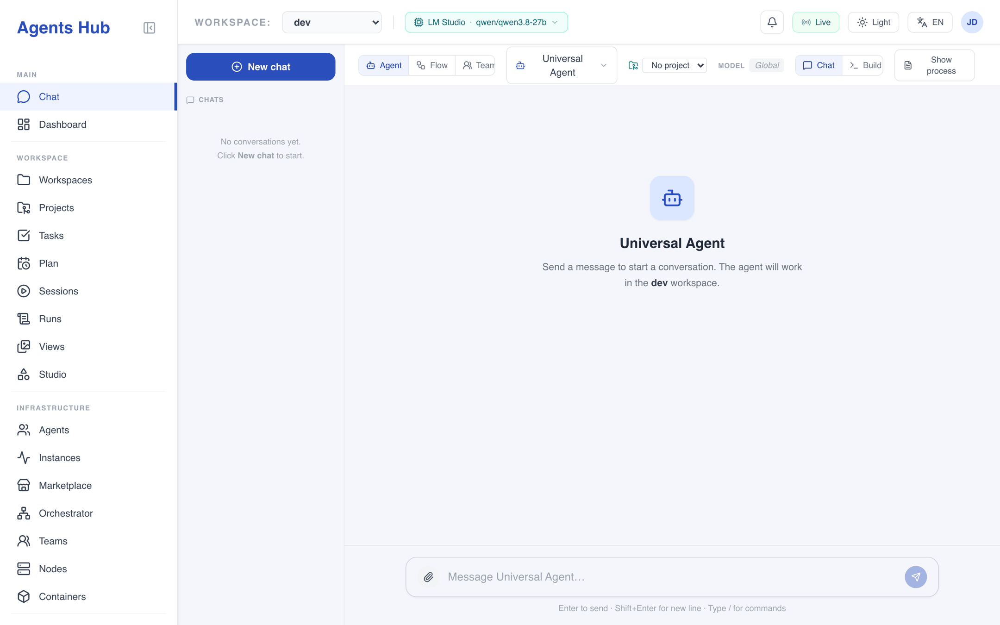
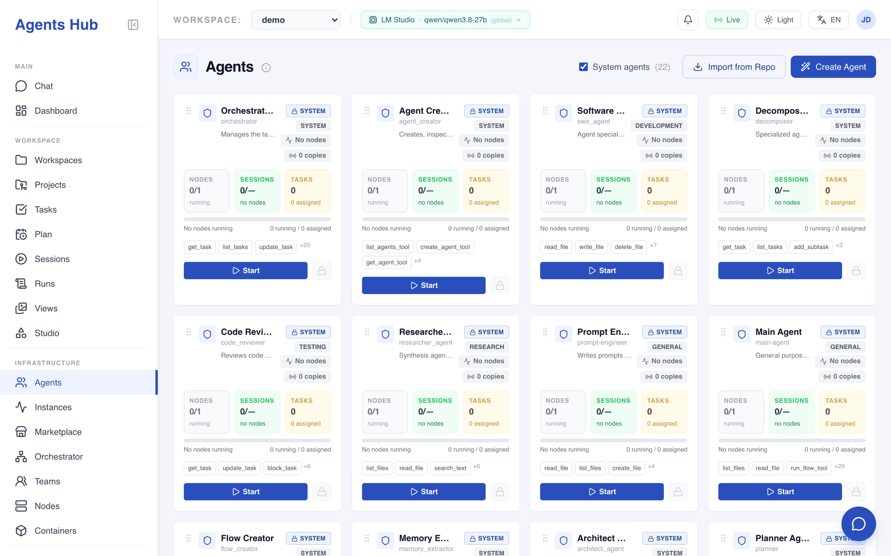
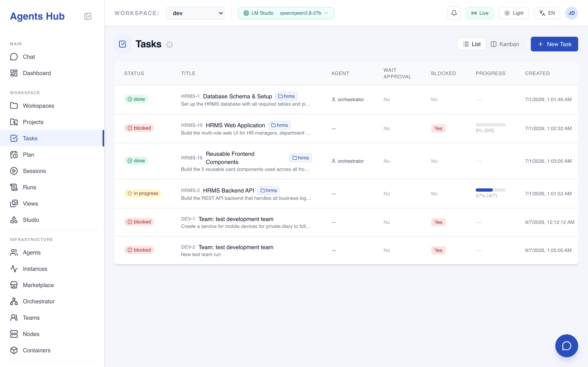
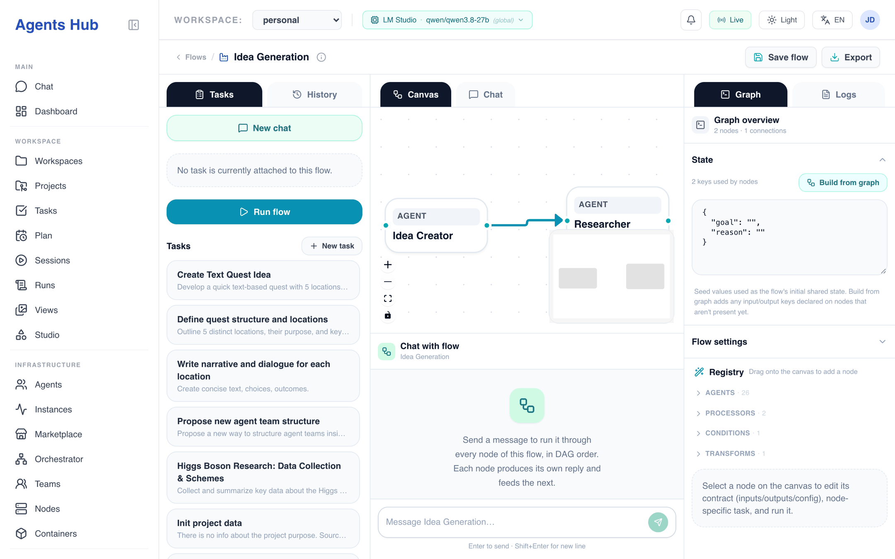
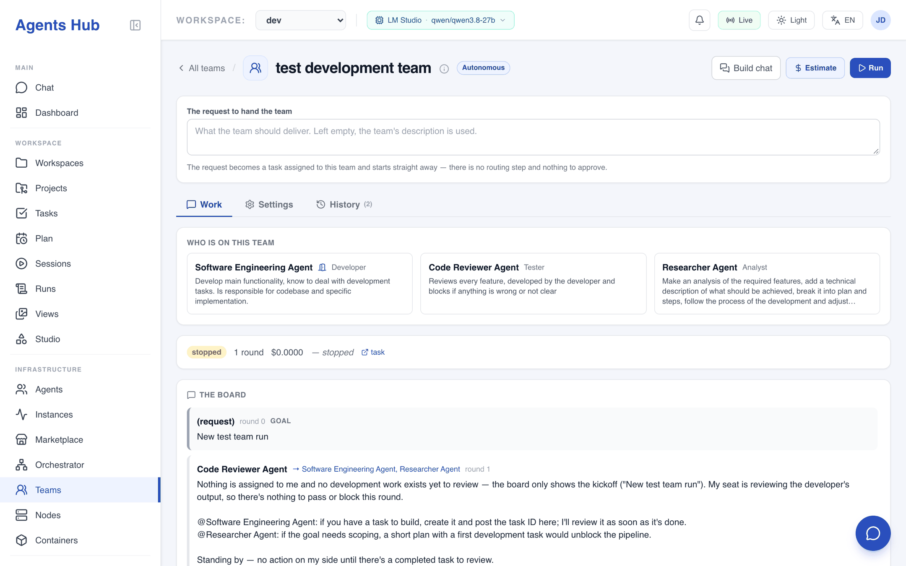
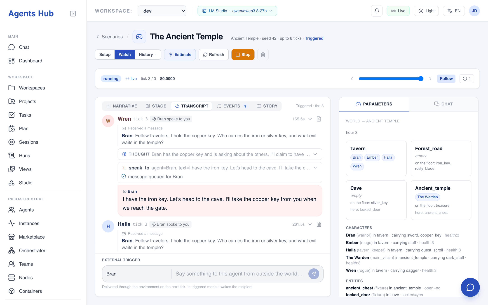

# Agents Hub

A local multi-agent development environment: define AI agents, give them tools
and memory, and run them, alone or in groups, against real work in a workspace.
A FastAPI backend, a React dashboard and a terminal client over the same
service, with file-based agent definitions, tasks, projects, flows, chat,
layered memory and optional Docker isolation.

It is built for iterative engineering on one machine. Point a workspace at a
repository you already have, hand an agent a task, and watch what it did:
every run is recorded with its prompt, tool calls, tokens and cost.

## Install and run

```bash
git clone <repo-url> agents_hub
cd agents_hub
./install.sh                    # venv, service, dashboard, the `ah` command, the shell hook
```

Put a provider key in the `.env` the installer created, then, in a new terminal:

```bash
ah up                           # API on :8000, dashboard on :5173
```

Open `http://localhost:5173`, pick an agent in Chat and send something. Or let
an agent work on a repository you already have:

```bash
cd ~/code/myapp
ah workspace init               # registers this directory in place, nothing is copied
ah agent run swe_agent "fix the failing test"
```

Docker instead of a local install: `docker compose up --build`, which publishes
the dashboard on `:8080`. The long form of
all three, including what to check when it will not start, is in
[docs/installation.md](./docs/installation.md).

## What it looks like

<table>
<tr>
<td width="50%"><a href="site/public/screenshots/chat.png"></a></td>
<td width="50%"><a href="site/public/screenshots/agents.png"></a></td>
</tr>
<tr>
<td><b>Chat.</b> Talk to any agent, flow or team. The header carries the workspace, the project and the model the next message will actually use.</td>
<td><b>Agents.</b> Every agent is a folder of layered markdown. Tools are granted by name, and each card shows what its agent holds and what it is running.</td>
</tr>
<tr>
<td><a href="site/public/screenshots/tasks.png"></a></td>
<td><a href="site/public/screenshots/flows.png"></a></td>
</tr>
<tr>
<td><b>Tasks.</b> Work that outlives a conversation: subtasks, dependencies, the agent on it, and a result you can come back to. Also a kanban board.</td>
<td><b>Flows.</b> A DAG of agents, edited on a canvas. The right panel holds the shared state the nodes read and write, the left one runs it against a task.</td>
</tr>
<tr>
<td><a href="site/public/screenshots/teams.png"></a></td>
<td><a href="site/public/screenshots/playground.png"></a></td>
</tr>
<tr>
<td><b>Teams.</b> A roster over one shared board. Every member posts to it, so the board is both the work and the record of how it went.</td>
<td><b>Playground.</b> Agents acting in a simulated world, tick by tick, with the thought behind each move, the action it took and the state that changed.</td>
</tr>
</table>

## What it does

**Run work.** Chat with any agent directly, or track it as a task with subtasks,
dependencies and a result that outlives the conversation. Four ways to put more
than one agent on a problem: **flows** (a DAG, each node once), **loops** (re-run
a flow until an agent judges the result good enough), **teams** (a roster over a
shared message board) and the **orchestrator** (route a task to the best fit).
Scheduled jobs fire future notifications, agent tasks and flow triggers.

**Define agents.** Every agent is a folder of layered markdown: `instructions.md`
plus optional `capabilities.md` and `usage.md`. Tools are granted by name and
nothing is granted by default. Memory comes in five layers (notes and structured
slots, episodic events, skills, a knowledge graph, RAG). A capability guard
refuses tool sets that compose into a data-exfiltration primitive. An agent that
already exists elsewhere can be imported from its own git repository and run in
its own process, streaming and token accounting intact.

**See what happened.** Agents answer with **views**, which are charts, graphs, 3D
scenes, simulations, tables, slides and documents, and keep editing them
conversationally in Studio. **Evals** turn "did that prompt change help" into a
number; any recorded run becomes a regression case, or is replayed against
another model and diffed. **Costs** are broken down by workspace, agent, model
and project, with budgets enforced at run launch rather than displayed. The
**web request log** keeps every page an agent fetched, with the text it actually
received.

**Operate it.** A React dashboard on a single server-sent event stream, a page
for every live copy of an agent with a mailbox you can write to, a model catalog
with per-model pricing and four-tier resolution, Telegram and GitHub/GitLab
connectors, optional Docker execution, optional API-token auth, and a CLI that
does all of it from a terminal.

## Documentation

The same corpus is published as a website: **https://snooker155.github.io/agents_hub/**
(landing page, search, and every document below). It is built from `docs/` by
[site/](./site/), so it is never out of step with what the app serves.

**Start here**

| | |
| --- | --- |
| [Installation](./docs/installation.md) | Prerequisites, the installer, by hand, Docker, upgrading |
| [First run, step by step](./SETUP.md) | The longer guided walkthrough from a fresh clone |
| [What this service is](./docs/overview.md) | How the objects nest, and the two things worth knowing early |
| [The CLI](./docs/cli.md) | `ah`, workspace selection, the shell integration, remote backends |
| [Troubleshooting](./docs/troubleshooting.md) | Symptoms, in the order people hit them |

**Using it**

| | |
| --- | --- |
| [Workspaces](./docs/workspaces.md) · [Projects](./docs/projects.md) · [Tasks](./docs/tasks.md) | The unit of isolation, the codebase inside it, the tracked work |
| [Agents](./docs/agents.md) · [System agents](./docs/system-agents.md) · [Imported agents](./docs/imported-agents.md) | What an agent is made of, and where agents come from |
| [Tools and capabilities](./docs/tools-and-capabilities.md) · [Skills](./docs/skills.md) · [Memory](./docs/memory.md) | What an agent can do, and what it can know |
| [Chat](./docs/chat.md) · [Page chat](./docs/page-chat.md) | Talking to an agent, and to the page you are on |
| [Flows](./docs/flows.md) · [Loops](./docs/loops.md) · [Teams](./docs/teams.md) | More than one agent, or more than one pass |
| [Views and Studio](./docs/views.md) · [Playground](./docs/playground.md) | What an agent builds to be looked at, and simulated worlds |
| [Evals](./docs/evals.md) · [Costs](./docs/costs.md) · [Web requests](./docs/web-logs.md) | Measurement: quality, money, and what came in from outside |
| [Sessions and runs](./docs/sessions-and-runs.md) · [Instances](./docs/instances.md) · [Nodes](./docs/nodes.md) · [Containers](./docs/containers.md) | Records of work, live copies, and the processes carrying them |
| [Settings](./docs/settings.md) · [Models](./docs/models.md) · [Marketplace](./docs/marketplace.md) · [Telegram](./docs/telegram.md) | Credentials, the catalog, sharing, the phone |
| [Scheduling](./docs/scheduling.md) · [Service health](./docs/service-health.md) | Future work, and whether the moving parts are alive |

**Going deeper**

| | |
| --- | --- |
| [Architecture](./ARCHITECTURE.md) | Runtime layers, folder structure, storage model, API surface, security posture |
| [Usage scenarios and runtime settings](./USAGE_SCENARIOS_AND_SETTINGS.md) | Every knob, and when to turn it |
| [Examples](./examples/README.md) | Worked examples, including an importable Aider agent |

The `docs/` corpus is not only for reading here. It is served in the app under
**Docs**, and agents read it through the `search_docs` and `read_doc` tools, so
asking an agent how the service works gets an answer from the shipped
documentation rather than from inference.

## A typical session

1. Configure a provider in Settings, then enable and price the models you intend
   to use on the Models page.
2. Create a workspace, or `ah workspace init` in a repository you already have.
3. Create tasks and assign them to an agent, or let the orchestrator route them.
4. Use chat, a flow, a loop, a team or a node, depending on the work.
5. Read the run logs, messages, results, views and generated files.
6. Iterate on the agent's layered instructions, its model and its tools, and
   curate its memory from the Memory Manager.
7. When a change needs proof rather than a hunch, turn a recorded run into an
   eval case and sweep it. When spend needs a ceiling, set a workspace budget.

## Status

Under active development. The runtime centers on `agents` / `managers` /
`runtime` / `instances` for execution, `flow` / `loops` / `teams` / `plans` for
multi-agent and scheduled work, `views` for presentation, `evals` /
`playground` for measurement, and `memory` / `tools` / `reasoning` for what an
agent can know and do. Agent prompts are layered markdown per agent; memory is
split into shared, episodic, procedural, graph and RAG subsystems; concurrent
state lives in SQLite.

**Stack.** Backend: FastAPI, Uvicorn, Pydantic, SQLite (WAL), the LangChain
ecosystem, Chroma / Pinecone / Qdrant for RAG, Typer for the CLI, Docker for
optional isolation. Frontend: React 19, Vite, Tailwind, React Router, React Flow,
and the view renderers (Vega-Lite, Cytoscape, three.js, Mermaid, KaTeX).
