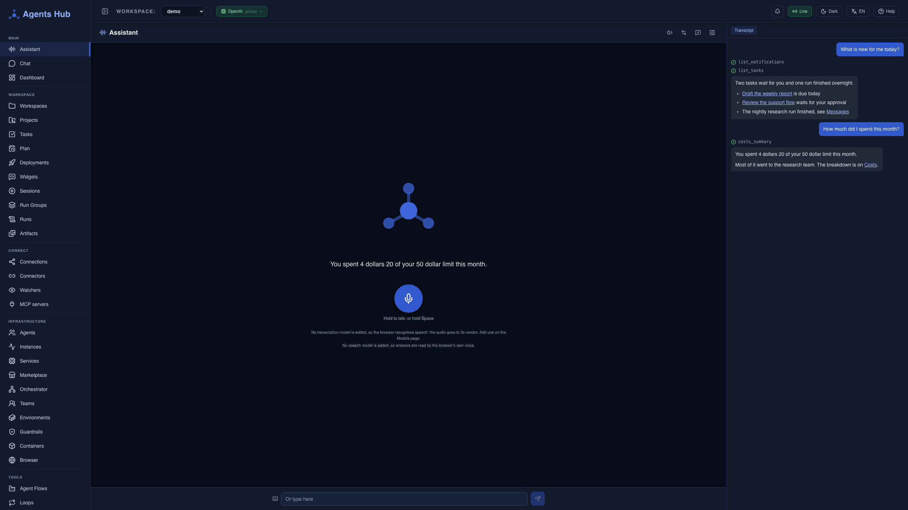
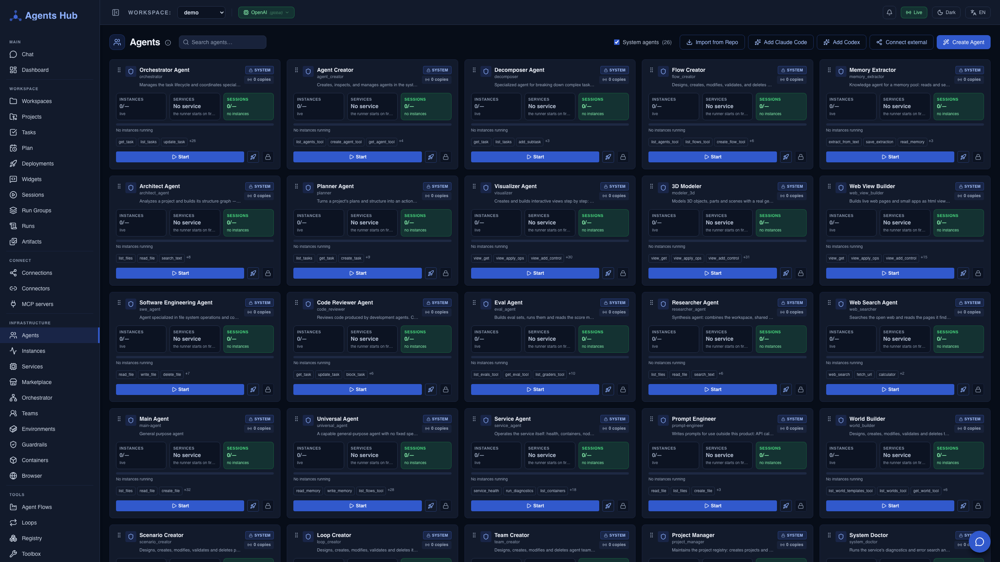
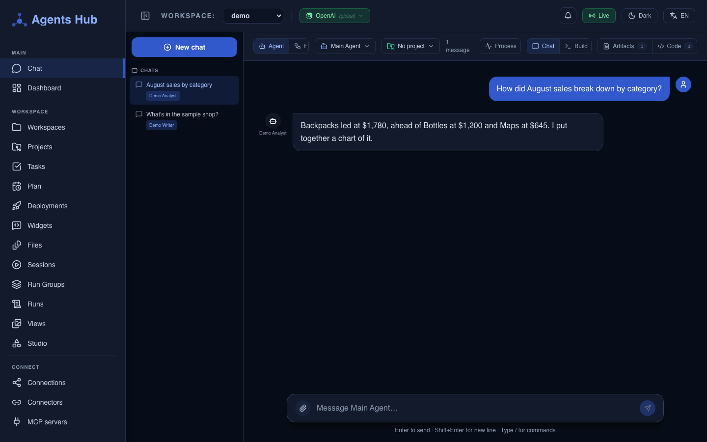
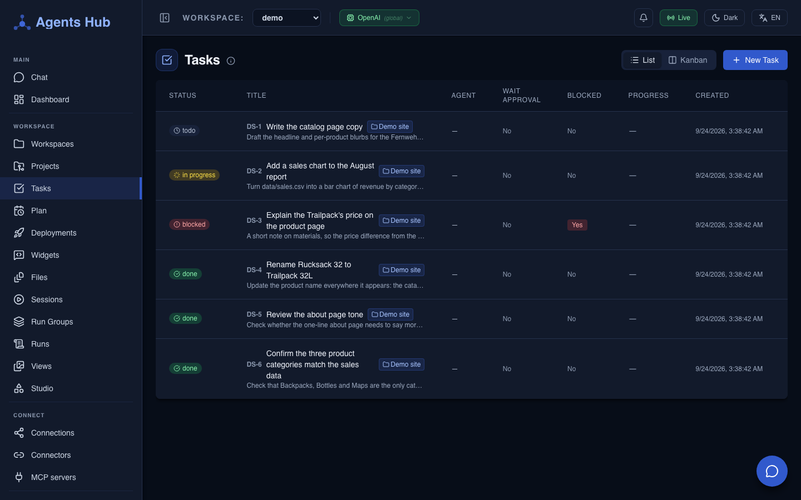
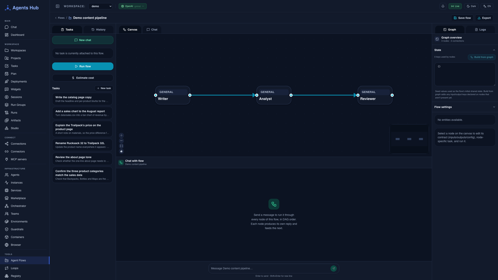
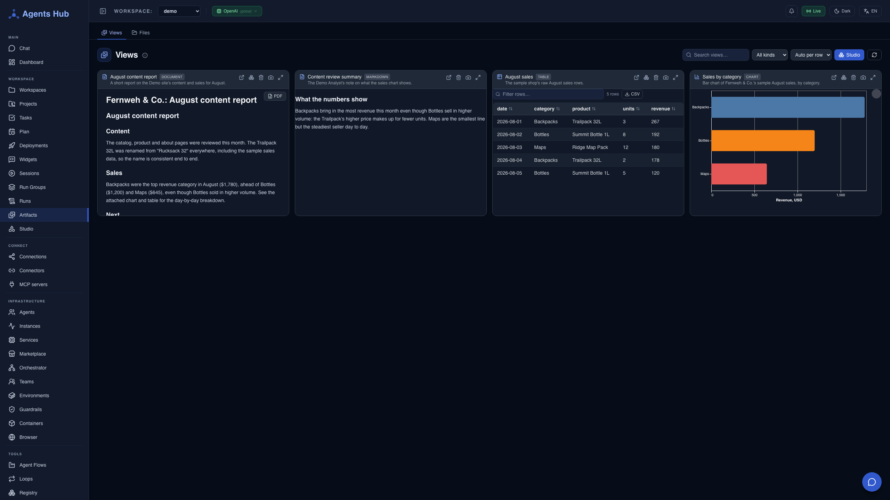
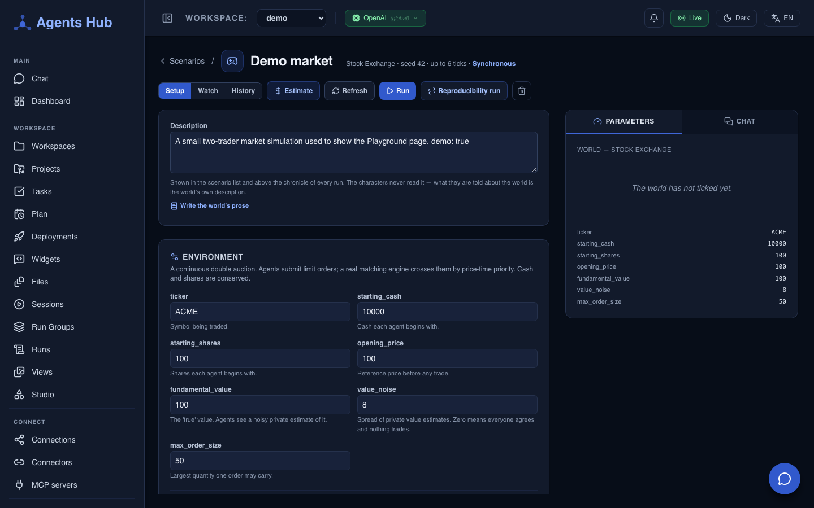

<p align="center">
  <a href="https://snooker155.github.io/agents_hub/"></a>
</p>

<h1 align="center">Agents Hub</h1>

<p align="center">
  Define AI agents, give them tools and memory, and run them, alone or in groups, against real work in a workspace.<br>
  Every run is recorded with its prompt, tool calls, tokens and cost.
</p>

<p align="center">
  <a href="https://github.com/snooker155/agents_hub/releases"></a>
  <a href="https://github.com/snooker155/agents_hub/actions/workflows/ci.yml"></a>
  <a href="https://github.com/snooker155/agents_hub/actions/workflows/pages.yml"></a>
  <a href="https://github.com/snooker155/agents_hub/pkgs/container/agents-hub-backend"></a>
  <a href="https://www.python.org/downloads/"></a>
  <a href="./LICENSE"></a>
</p>

<p align="center">
  <a href="https://snooker155.github.io/agents_hub/">Website</a> ·
  <a href="https://snooker155.github.io/agents_hub/guide/overview">Documentation</a> ·
  <a href="https://snooker155.github.io/agents_hub/demo/index.html">Live demo</a> ·
  <a href="https://snooker155.github.io/agents_hub/recipes/">Recipes</a> ·
  <a href="./CHANGELOG.md">Changelog</a>
</p>

<p align="center">Current release: <b><!-- version -->0.9.0<!-- /version --></b> (<a href="./CHANGELOG.md">what changed</a>)</p>

---

Agents Hub is a self-hosted multi-agent development environment. A FastAPI
backend, a React dashboard and a terminal client over the same service, with
file-based agent definitions, tasks, projects, flows, chat, layered memory and
optional Docker isolation. Point a workspace at a repository you already have,
hand an agent a task, and watch what it did.

It runs on one laptop from two Docker images, and it runs as a cluster with
Postgres, workers and a Helm chart. Same code, same records.

## Getting started

### 1. Docker, for one person

The published images, two files in an empty folder, one command. Nothing to
clone or build.

```bash
mkdir agents-hub && cd agents-hub
curl -fsSLO https://raw.githubusercontent.com/snooker155/agents_hub/main/deploy/quickstart/docker-compose.yml
curl -fsSL  https://raw.githubusercontent.com/snooker155/agents_hub/main/deploy/quickstart/env.example -o .env
docker compose up -d
```

Open **http://localhost:8080**, put a provider key in Settings (or uncomment
one in `.env` first), pick an agent in Chat and send something.

- State lives on the `agents_hub_data` volume; `.env` is mounted into the
  backend, so keys entered in Settings survive an upgrade.
- `docker compose pull && docker compose up -d` upgrades to the newest release.
  `AGENTS_HUB_TAG=0.8` in `.env` pins one.
- `DEMO_WORKSPACE=1` in `.env` seeds a demo workspace on the first start, so
  every page has something to look at.
- Agents run as subprocesses of the backend in this shape. Containers per
  agent, the browser service and the sandbox need the checkout below.

### 2. From source

For working on the code, or for the shape with per-agent containers.

```bash
git clone https://github.com/snooker155/agents_hub.git
cd agents_hub
./install.sh                    # venv, service, dashboard, the `ah` command, the shell hook
```

On a first install it ends in `ah setup`, which asks for the database, the
accounts, the providers and their default models, then offers to start the
hub. Otherwise, in a new terminal:

```bash
ah up                           # API on :8000, dashboard on :5173
```

Or the same checkout under Docker, built from source, with the Docker socket
mounted so agents can get containers of their own:

```bash
docker compose up --build       # backend :8000, dashboard :8080
```

Prerequisites for the local install are Python 3.11+ and Node.js 22+. The
long form of every path, including what to check when it will not start, is in
[docs/installation.md](./docs/installation.md).

### 3. First run

```bash
cd ~/code/myapp
ah workspace init               # registers this directory in place, nothing is copied
ah agent run swe_agent "fix the failing test"
```

Then, in the dashboard: enable and price the models you intend to use on the
Models page, create tasks and assign them to an agent or let the orchestrator
route them, and read the run log, the messages, the result and the views it
produced. When a prompt change needs proof rather than a hunch, turn a recorded
run into an eval case and sweep it. When spend needs a ceiling, set a workspace
budget.

## What it looks like

Every screen below is the real dashboard over the recorded demo workspace; the
[live demo](https://snooker155.github.io/agents_hub/demo/index.html) is the
same thing in your browser, with nothing to install.

<table>
<tr>
<td colspan="2"><a href="site/public/screenshots/dark/assistant.png"></a></td>
</tr>
<tr>
<td colspan="2"><b>Assistant.</b> The whole service through one agent, by voice or text: hold the button and speak, hear the first paragraph of the answer, and open the pages it links beside the conversation.</td>
</tr>
<tr>
<td width="50%"><a href="site/public/screenshots/dark/agents.png"></a></td>
<td width="50%"><a href="site/public/screenshots/dark/chat.png"></a></td>
</tr>
<tr>
<td><b>Agents.</b> Every agent is a folder of layered markdown. Tools are granted by name, and each card shows what its agent holds and what it is running.</td>
<td><b>Chat.</b> Talk to any agent, flow or team. The header carries the workspace, the project and the model the next message will use; the panels hold the turn's trail, its files and its code.</td>
</tr>
<tr>
<td><a href="site/public/screenshots/dark/tasks.png"></a></td>
<td><a href="site/public/screenshots/dark/flows.png"></a></td>
</tr>
<tr>
<td><b>Tasks.</b> Work that outlives a conversation: subtasks, dependencies, the agent on it, and a result you can come back to. Also a kanban board.</td>
<td><b>Flows.</b> A DAG of agents, edited on a canvas. The right panel holds the shared state the nodes read and write, the left one runs it against a task.</td>
</tr>
<tr>
<td><a href="site/public/screenshots/dark/views.png"></a></td>
<td><a href="site/public/screenshots/dark/playground.png"></a></td>
</tr>
<tr>
<td><b>Views.</b> What an agent answers with when text is not enough: charts, tables, documents, slides, graphs and 3D scenes, edited further in Studio.</td>
<td><b>Playground.</b> Agents acting in a simulated world, tick by tick: an environment with parameters, characters, and a chronicle of every move and the thought behind it.</td>
</tr>
</table>

The website shows the same pictures in whichever theme you read it in.

## What it does

- **Run work.** Chat with an agent or hand it a task. Put several on one problem as a flow, a loop, a team, or through the orchestrator. Keep an agent running as an instance or a service.
- **Define agents.** A folder of markdown, tools granted by name, layered memory, guardrails, structured output. Import one from git, or run Claude Code or Codex.
- **See what happened.** Every run keeps its prompt, tool calls, tokens and cost. Agents answer with views: charts, tables, documents, slides. Evals turn a prompt change into a number.
- **Ship and connect.** Deploy a project's app from inside the hub. Expose agents on an OpenAI-compatible `/v1`, as a chat widget, or over Telegram. Agents running elsewhere report in over one callback.
- **Operate it.** One dashboard and CLI: cluster, models, MCP, SSO with SCIM, audit, budgets, health and SLOs.

## Deployment options

| Shape | Start it | Made of | For |
| --- | --- | --- | --- |
| **Single user, published images** | [`deploy/quickstart/docker-compose.yml`](./deploy/quickstart/docker-compose.yml) | Backend and dashboard images from GHCR, a named volume, agents as subprocesses | One person on one machine, nothing to clone or build |
| **Compose from a checkout** | `docker compose up --build` | The same two images built from source, the checkout bind mounted, the Docker socket for per-agent containers | One machine, with containers for agents, the browser service and the sandbox |
| **Local install** | `./install.sh`, then `ah up` | A virtualenv and the Vite dev server | Working on the code |
| **Compose with profiles** | `--profile postgres`, `--profile scale`, `--profile browser` | Postgres instead of SQLite, Redis for several backend replicas, headless Chromium | One machine that has outgrown SQLite or one replica |
| **Compose `ha` profile** | `docker compose --profile ha up --build` | Postgres, Redis, MinIO, two `api` replicas, two `worker` replicas | A team on one machine, or a few sharing a mount |
| **Helm chart** | `helm install agents-hub deploy/helm/agents-hub` | `api`, `worker` and `frontend` Deployments against managed Postgres, Redis and S3 | A cluster |

Every release publishes `agents-hub-backend`, `agents-hub-frontend`,
`agents-hub-agents`, `agents-hub-models` and `agents-hub-browser` to GHCR for
amd64 and arm64, the backend and agents images in two flavours: plain, and
`-rag` with the embedding stack. Upgrades, rollbacks and the release process
are in [docs/deployment.md](./docs/deployment.md); the Helm chart has its own
[README](./deploy/helm/agents-hub/README.md).

## Documentation

The same corpus is published as a website, **https://snooker155.github.io/agents_hub/**,
with a landing page, search, recipes and the live demo. It is built from
[docs/](./docs/) by [site/](./site/), so it is never out of step with what the
app serves: the corpus is also shown in the dashboard under **Docs**, and agents
read it through the `search_docs` and `read_doc` tools, so asking an agent how
the service works gets an answer from the shipped documentation.

**Start here**

| | |
| --- | --- |
| [Installation](./docs/installation.md) | Docker from the published images, Compose from a checkout, the installer, by hand; upgrading |
| [Deploying](./docs/deployment.md) | Every shape, the `ha` profile, the Helm chart, the cluster map, releases, upgrades and rollbacks |
| [What this service is](./docs/overview.md) | How the objects nest, and the two things worth knowing early |
| [The CLI](./docs/cli.md) | `ah`, workspace selection, the shell integration, remote backends |
| [Troubleshooting](./docs/troubleshooting.md) · [Runbook](./docs/runbook.md) | Symptoms, in the order people hit them |
| [Changelog](./CHANGELOG.md) · [First run, step by step](./SETUP.md) | What each release changed, and the long guided walkthrough |

**Using it**

| | |
| --- | --- |
| [Workspaces](./docs/workspaces.md) · [Projects](./docs/projects.md) · [Project deployments](./docs/project-deployments.md) · [Tasks](./docs/tasks.md) · [Files](./docs/files.md) | The unit of isolation, the codebase inside it, that codebase running from inside the hub, the tracked work, the files |
| [Agents](./docs/agents.md) · [System agents](./docs/system-agents.md) · [Imported agents](./docs/imported-agents.md) · [Agent loop](./docs/agent-loop.md) | What an agent is made of, where agents come from, how a turn runs |
| [Tools and capabilities](./docs/tools-and-capabilities.md) · [Tool policy](./docs/tool-policy.md) · [Guardrails](./docs/guardrails.md) · [Skills](./docs/skills.md) · [Memory](./docs/memory.md) · [Secrets](./docs/secrets.md) | What an agent can do, and what it can know |
| [Chat](./docs/chat.md) · [Page chat](./docs/page-chat.md) · [Steering](./docs/steering.md) · [Handoffs](./docs/handoffs.md) · [Widget](./docs/widget.md) · [Telegram](./docs/telegram.md) · [Browser](./docs/browser.md) | Talking to an agent, from the page, the web, the phone |
| [Flows](./docs/flows.md) · [Loops](./docs/loops.md) · [Teams](./docs/teams.md) · [Instances](./docs/instances.md) · [Services](./docs/services.md) | More than one agent, more than one pass, agents kept running |
| [Views and Studio](./docs/views.md) · [Playground](./docs/playground.md) | What an agent builds to be looked at, and simulated worlds |
| [Evals](./docs/evals.md) · [Outcomes](./docs/outcomes.md) · [Costs](./docs/costs.md) · [Web requests](./docs/web-logs.md) · [Sessions and runs](./docs/sessions-and-runs.md) · [Audit](./docs/audit.md) | Measurement: quality, money, what came in from outside, what happened |
| [Models](./docs/models.md) · [Local models](./docs/local-models.md) · [The hub as a provider](./docs/hub-as-provider.md) · [Model structure](./docs/model-structure.md) | The catalog, models on this machine, agents on `/v1` |
| [Connections](./docs/connections.md) · [Connectors](./docs/connectors.md) · [MCP servers](./docs/mcp.md) · [Marketplace](./docs/marketplace.md) · [Registry](./docs/registry.md) · [GitHub App](./docs/github-app.md) · [Notifications](./docs/notifications.md) | What the hub is wired to |
| [Settings](./docs/settings.md) · [Containers](./docs/containers.md) · [Environments](./docs/environments.md) · [Sandboxes](./docs/sandboxes.md) · [Service health](./docs/service-health.md) · [SLO](./docs/slo.md) · [System workspace](./docs/system-workspace.md) | Credentials, isolation, whether the moving parts are alive |
| [Scaling](./docs/scaling.md) · [Workers](./docs/workers.md) · [Storage](./docs/storage.md) · [Backup](./docs/backup.md) | Postgres, the launch queue, the object store, the copy you restore |
| [Identity](./docs/identity.md) · [SSO](./docs/sso.md) · [SCIM](./docs/scim.md) · [API keys](./docs/api-keys.md) | Who can do what |

**Going deeper**

| | |
| --- | --- |
| [Architecture](./ARCHITECTURE.md) | Runtime layers, folder structure, storage model, API surface, security posture |
| [Usage scenarios and runtime settings](./USAGE_SCENARIOS_AND_SETTINGS.md) | Every knob, and when to turn it |
| [Examples](./examples/README.md) | Worked examples, including an importable Aider agent |
| [Contributing](./CONTRIBUTING.md) | Backend, frontend, CLI and test patterns |

## Stack

Backend: FastAPI, Uvicorn, Pydantic, SQLite (WAL) or Postgres, Redis for more
than one replica, the LangChain ecosystem, Chroma / Pinecone / Qdrant for RAG,
Typer for the CLI, Docker for optional isolation. Frontend: React 19, Vite,
Tailwind, React Router, React Flow, and the view renderers (Vega-Lite,
Cytoscape, three.js, Mermaid, KaTeX). Site: VitePress on GitHub Pages, with
the dashboard's recorded demo.

Under active development. While the major version is 0, a minor release may
change the API or the configuration and says so in the changelog; a release
with schema migrations says how it rolls back.

## License

Source-available under the [Agents Hub Personal Evaluation License](./LICENSE):
one person may read, run and modify it on a machine they control, for
evaluation and personal use. Redistribution, hosting for others, commercial
and production use need a separate agreement with the copyright holder.
