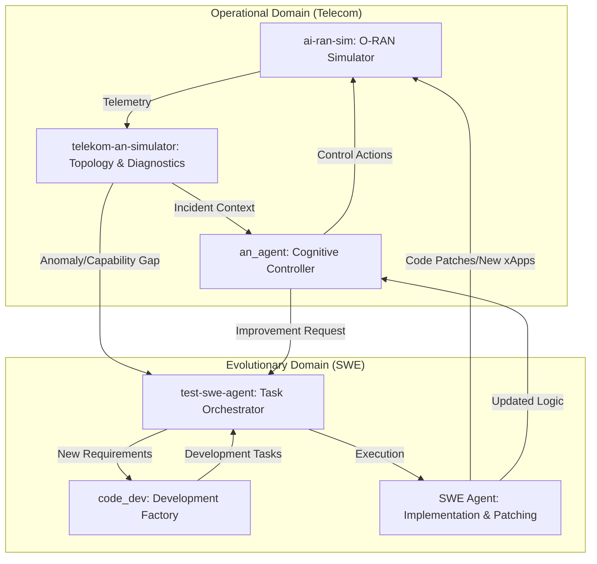

# Unified Architecture: Autonomous Network Self-Evolution Framework

## 1. Vision
The goal is to create a closed-loop system where the **Autonomous Network (AN)** not only manages itself in real-time but also **evolves its own code and capabilities** when it encounters limitations, bugs, or changing requirements. This merges Telecom Research with AI-driven Software Engineering.

## 2. High-Level Architecture

The architecture consists of two primary domains: the **Operational Domain** (Telecom) and the **Evolutionary Domain** (Software Development).



---

## 3. Component Roles

### 3.1 Operational Domain (Network)
*   **`ai-ran-sim`**: Acts as the high-fidelity environment. It provides the physical and protocol layers of an O-RAN network, simulating Base Stations, UEs, and core components.
*   **`telekom-an-simulator`**: Provides the management plane. It maintains the network topology and runs distributed diagnostic agents on each node to identify localized issues.
*   **`an_agent`**: The "brain" of the network. It uses a Sifakis-inspired architecture with reactive (sub-10ms) and proactive loops to optimize network performance (e.g., Load Balancing, Energy Saving).

### 3.2 Evolutionary Domain (Development)
*   **`code_dev`**: A team of specialized agents (PM, BA, SD, TL, Dev, QA) that transforms high-level requirements or bug reports into technical designs and actionable tasks.
*   **`test-swe-agent`**: The orchestrator that manages the lifecycle of development tasks. it assigns tasks to specialized agents and ensures they are executed in a safe workspace.
*   **SWE Agent**: A focused agent capable of using tools to read/write code, apply patches, and run tests within the simulator's codebase.

---

## 4. Integration Strategy

### 4.1 Unified Data Models
To bridge the domains, we unify the core entities:
*   **`Incident` (from Telecom)**: Represents a detected network anomaly.
*   **`Requirement` (from BA)**: Derived from Incidents that cannot be solved by parameter tuning alone.
*   **`Task` (Unified)**: A common structure for tracking work across both human and AI agents.

### 4.2 Shared Event Bus
An integration layer that connects `an_agent`'s internal Event Bus with the `test-swe-agent` Orchestrator.
*   **Telecom Events**: `KPI_DEGRADED`, `ANOMALY_DETECTED`, `POLICY_FAILED`.
*   **Development Events**: `TASK_CREATED`, `CODE_PATCHED`, `TEST_PASSED`.

### 4.3 The Self-Evolution Loop
1.  **Detection**: `telekom-an-simulator` detects a recurring "Handover Failure" that current policies cannot fix.
2.  **Escalation**: `an_agent` identifies a "Capability Gap" and sends an event to the Orchestrator.
3.  **Design**: `code_dev` BA and SD agents analyze the simulator code and design a new xApp for predictive handover.
4.  **Implementation**: SWE Agent implements the new xApp and applies it to the `ai-ran-sim` environment.
5.  **Verification**: QA agents run simulation scenarios to verify the fix.
6.  **Deployment**: The new policy is promoted to the active controller.

---

## 5. Proposed Directory Structure (Monorepo)

To facilitate integration, we propose a unified structure:

```text
/
├── core/                   # Shared libraries & base classes
│   ├── agents/             # Unified Agent base classes
│   ├── communication/      # Global Event Bus & WebSocket handlers
│   └── models/             # Shared Pydantic models (Task, Incident, etc.)
├── domains/
│   ├── telecom/            # Operational components
│   │   ├── simulator/      # (ai-ran-sim)
│   │   ├── topology/       # (telekom-an-simulator)
│   │   └── controller/     # (an_agent)
│   └── swe/                # Evolutionary components
│       ├── factory/        # (code_dev)
│       └── orchestrator/   # (test-swe-agent)
├── dashboard/              # Unified Web UI
└── workspace/              # Shared scratchpad for SWE agents
```

## 6. Common Standards
*   **Tech Stack**: Standardization on **FastAPI** for backends and **React/Tailwind** for frontends.
*   **Agent Communication**: All agents should support a common **tool-calling** interface (standardized via LangChain/LangGraph).
*   **Observability**: Centralized logging via a shared service (based on the dashboard in `test-swe-agent`).
